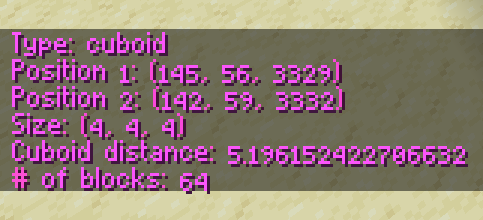

# //size

`//size`, among other things, prints information about the selection. **This can be done without a conductor.**

Among other things, it prints useful information like distance between points and the area of your selection.

Useful applications include measuring the distance between places and dividing a structure into parts to fit under the operation limit of WorldEdit.
