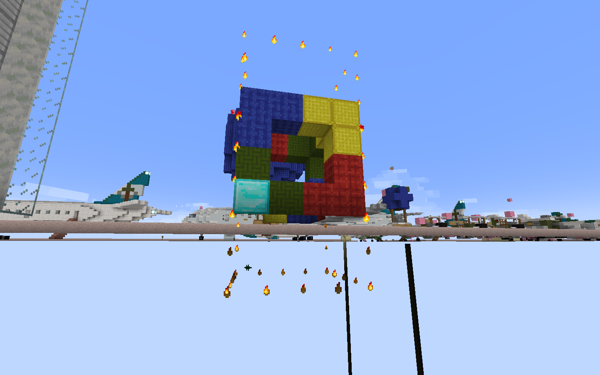

# Selection 2 (//shift, //expand, //contract, //inset, //outset)

This isn't really considered basic, but I added it here because it is a massive time-saver.

`//shift` shifts the selection a certain number of blocks in a direction. It is similar to `//move` but the selection is moved instead of the contents. For example, `//shift 5 w` moves the selection 5 blocks to the west.

`//expand` expands the selection a certain number of blocks towards a direction. For example, `//expand 4 u` expands the selection 4 blocks upward.

`//contract` contracts the selection instead. Think of it as pushing the selection back a certain number of blocks from a direction. For example, `//contract 2 d` renoves 2 layers from the top of the selection.

`//outset` and `//inset` are kind of like shortcuts for doing multiple `//expand`s and `//contract`s respectively. `//outset` expands the selection in all 6 directions, eg. `//outset 2`:

It can also expand in only horizontal or vertical directions with the `-h` and `-v` flag respectively, eg. `//outset -h 2` and `//outset -v 2`:

`//inset` is the reverse and contracts the selection instead, with the same flags.