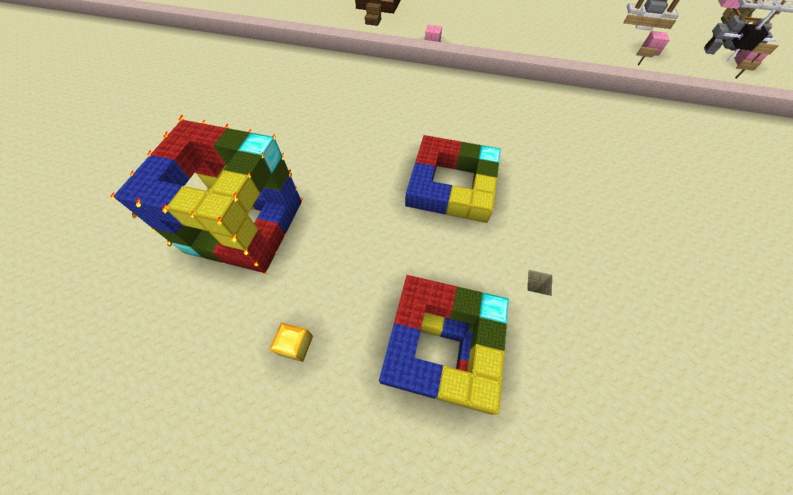

# Clipboard 1 (//copy, //cut, //paste)

This is one of the harder topics to explain, but with some intuition it will make sense.

`//copy` is like `Ctrl+C`: copies the current selection to the clipboard. `//cut` is like `Ctrl+X`: same as `//copy`, but replaces the blocks in the selection with air (by default). `//paste` is like `Ctrl+V` and simply pastes the contents of the clipboard.

The clipboard is **relative to the player's position when it was copied or cut**. For example, if you were to copy a selection, stand two blocks in front of it and copy, when you paste the clipboard, it would be two blocks behind you.

In the image below, the gold is the copy point and the emerald are the paste points. Note how the copies are at the same position relative to the emerald, as that of the original copy relative to the gold.

If a conductor is doing a w/e for you, remember to specify copy/cut/paste points. You should

* mark a copy point with a visible material (preferably different fron that of points), stand next to it and say "copy on (block)" or "copy here"
* copying from a point is also possible, for example "copy on p2"

`//copy` has two flags (options):
* `-e` to copy entities to the clipboard.
* `-m <mask>` to only include specific blocks from the selection. For example, `//copy -m stone`

You can also have multiple options: `//copy -e -m <mask>` or `//copy -em <mask>` since `-e` does not take further arguments.

`//cut` has the same flags as `//copy`, together with one additional optional argument `[fill]` which sets the selection to the block(s) specified instead of air after copying. For example, `//cut stone` replaces the selection with stone after cutting.

Clipboards may unintentionally be cleared, so if you need a backup of something you intend to `//cut`, please consider copying instead, or having a backup somewhere.

There has been one case where someone lost an entire airplane due to this

`//paste` has a few flags:
* `-e` to paste entities in the clipboard.
* `-a` to prevent air from being pasted.
* `-m <mask>` to only paste specific blocks in the clipboard.
* `-s` to move the current selection to the region that has been pasted.

In this image, the top sunken cube was `//copy`'d, and then pasted with `-a` and you can see the sandstone in the middle of the cube showing that it did not get replaced by the air in the clipboard. The bottom sunken cube was not pasted with `-a` thus there is air in the cube instead of sandstone.

In this image, `//paste -m red_wool` was used. This can also be achieved with `//copy -m red_wool` and then `//paste`:

Note that if you want to paste entities, you must `//copy` **and** `//paste` with the `-e` flag.
