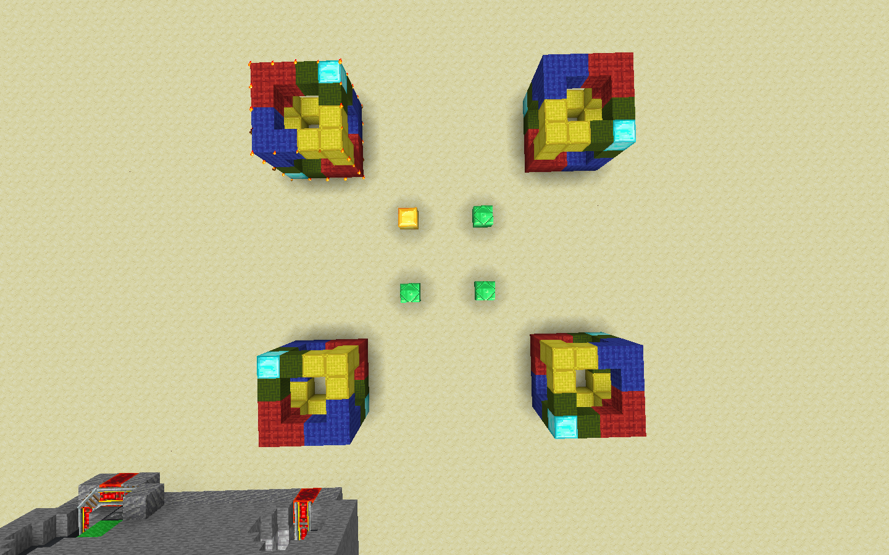
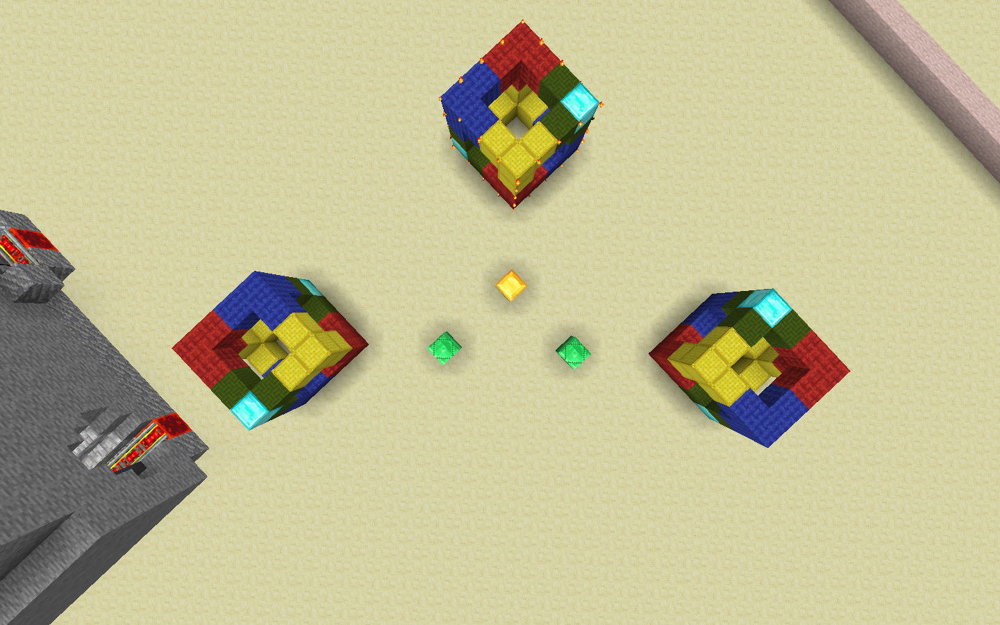

# Clipboard 2 (//rotate, //flip)

After copying to the clipboard, its contents can be rotated or flipped.

`//rotate` does rotation. Specify the angle to rotate in degrees (it can also be negative). For example, `//rotate 90` or `//rotate -90`. Note that angles that are not multiples of 90 are not recommended as they may leave holes in the contents.

In this image, the top-left is the original cube and is also the result of pasting after a `//rotate 0`. From top-left clockwise, the copies are the result of: `//rotate 90`, `//rotate 180`/`-180`, `//rotate -90`

`//flip` does flipping. Specify the direction to flip to (n/s/e/w/u/d/ne/nw/se/sw). For example, `//flip n` to flip it in the north-south direction.

In this image, the center is the original cube, and north is to the top-right. The left cube is a result of `//flip n`/`s`, and the right `//flip e`/`w`.

Note that these are done relative to the player's point when the contents are copied to the clipboard.

Both of these by default rotate and flip along the horizontal plane. Rotating and flipping along the vertical plane is covered in TODO.
