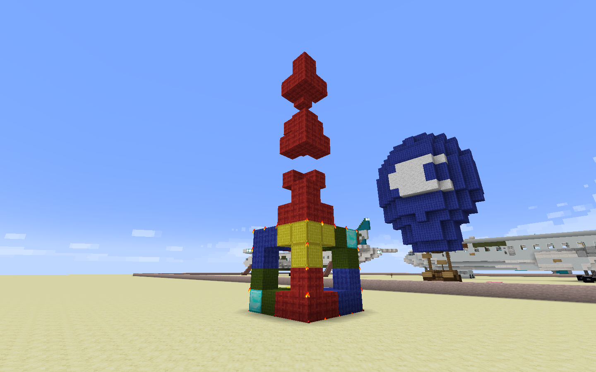

# //stack

`//stack` stacks the selection in a particular direction, and is essentially the faster way of pasting a section individually.

It is also your favourite command, good luck with Mojangitis lol

You need to give it the number of times to stack, and the direction to stack. For example, `//stack 5 u` stacks the selection upwards 5 times.

It also supports the following flags:
* `-a` is like in `//paste`, to prevent the air in the selection from being stacked in the stacked sections.
* `-m <mask>` to only stack certain blocks.
* `-e` to also stack entities.
* `-s` to shift the selection to the last section stacked.

This image shows the result of `//stack 3 u`: 3 copies over the original copy.

This image shows the result of `//stack 3 u -s`: same as above but the selection is moved to the last/furthermost copy.

This image shows the result of `//stack 3 up -m red_wool`: only the red wool is stacked.

More about `//stack` is covered in TODO.