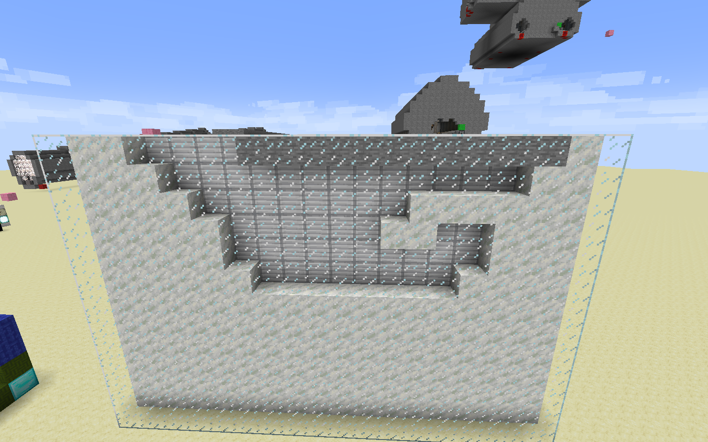
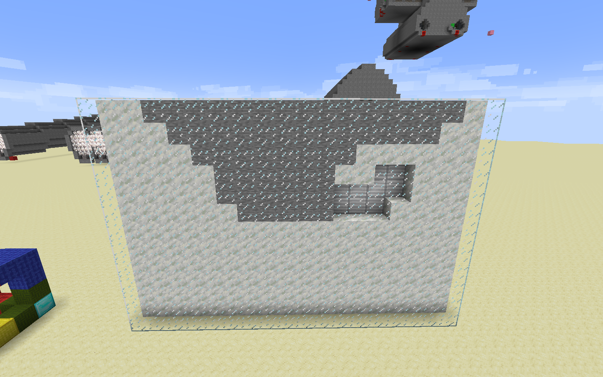
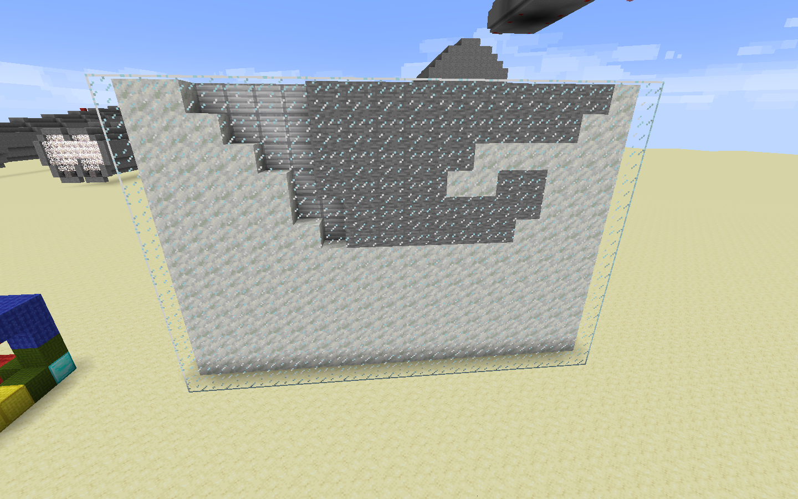
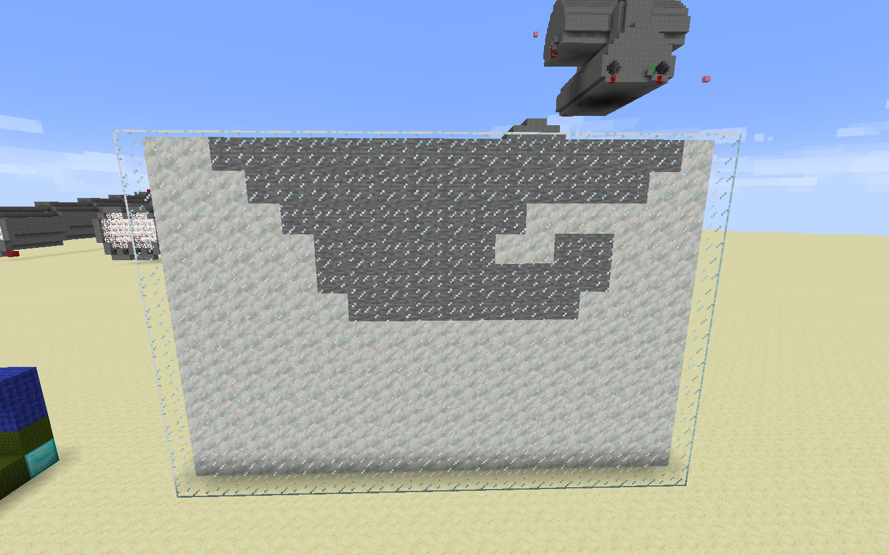

# //fill and //fillr

Both fill a hole or depression, and do not need a selection. They consider all the air around and under the player's feet and fills it with the specified block(s).

For example, if I were to be standing on the side of a valley, `//fill stone 10` would cover the valley with stone within 10 blocks of the player, but below the stone is air.

An extra number, like in `//fill stone 15 6` would fill for the Y-levels between that of the player's feet and 6-1=5 blocks below that.

The difference between `//fill` and `//fillr` is shown below: it fills any air pockets below the top Y-level.

For example, these show `//fillr stone 10 6` and `//fillr stone 15 6` respectively:

