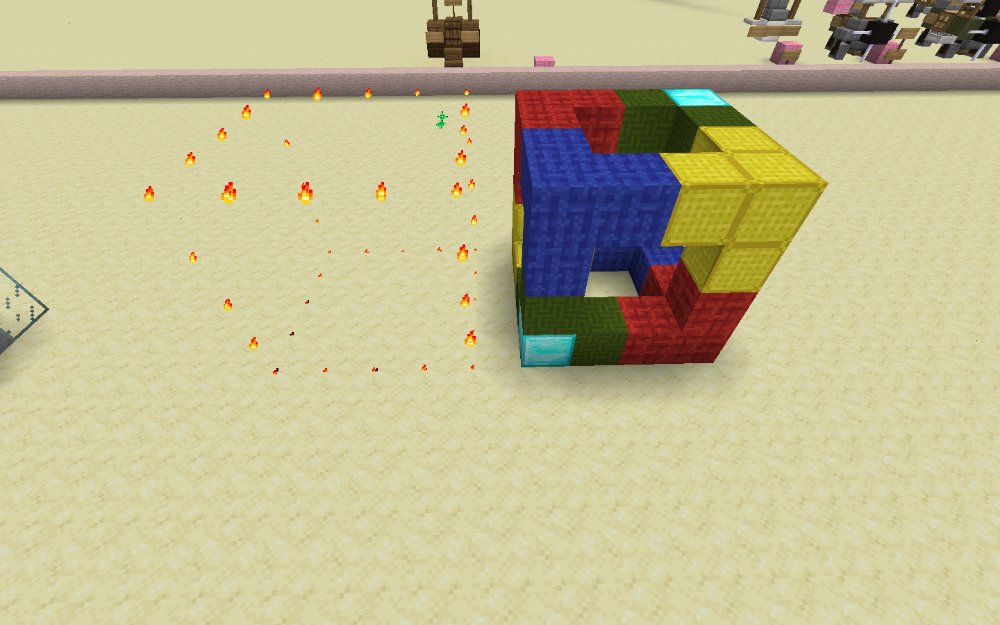
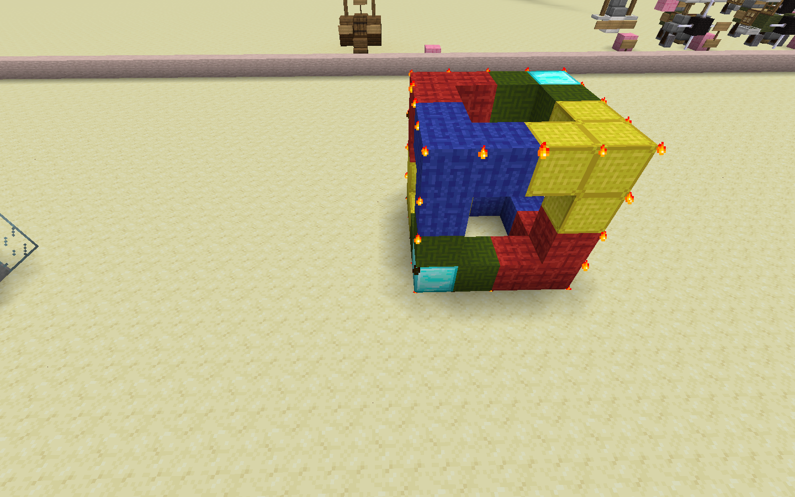
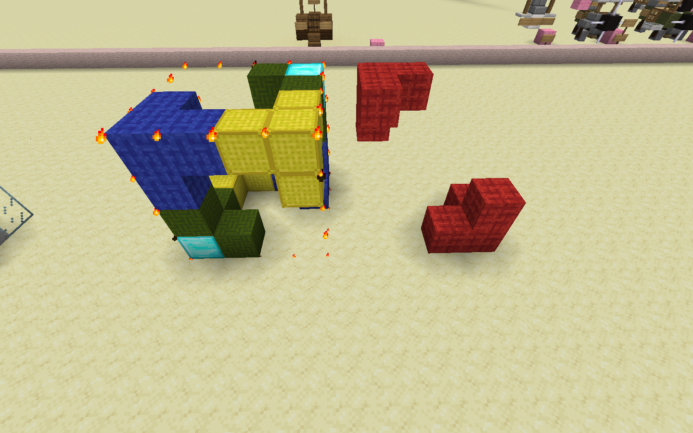

# //move

This moves the selection to a direction, given the number of blocks to move and a direction.

For example, `//move 5 w` moves the blocks in the selection 5 blocks to the west.

**Note that the selection by itself does not move along with the blocks, use `-s` to also move the selection.**

It accepts the following flags:
* `-a` to prevent air from being moved along with the contents.
* `-m <mask>` to only move specific blocks.
* `-e` to also move entities.
* `-s` to also move the selection along with the blocks.

This image shows the result of `//move 5 w -m red_wool`.
